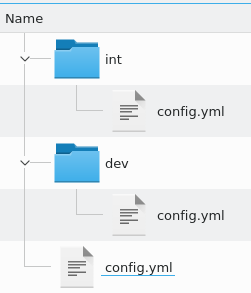
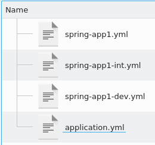

# Product Versioned Configuration System
[](https://travis-ci.com/vecosy/vecosy)
[](https://codecov.io/gh/vecosy/vecosy)
[](https://hub.docker.com/repository/docker/vecosy/vecosy)


**vecosy** is a centralized configuration system


## Features
* confiurable by a GIT repo
* GRPC
* Spring cloud configuration compatible
* REST
* Auto update (currently only with golang client)
* K8s ready by [HELM](https://github.com/vecosy/helm)

# Configuration Repo

## Branching convention
The app configuration is stored in a git repository, vecosy use a branch name convention to manage different configuration on the same repository  `appName/version`
(i.e [app1/1.0.0](https://github.com/vecosy/config-sample/tree/app1/1.0.0)).

## Versions
When a configuration request is processed, the system will find the related branch on the git repo `appname/appVersion` if the specific version is not present, the nearest (`<=`) version will be used. 

## Merging strategies
Vecosy supports two different merging systems, each one use a different naming convention to merge configuration files.

### SmartConfig


The `config.yml` in the root folder is the common configuration that will be merged by the specific environment `config.yml`.


#### Example
https://github.com/vecosy/config-sample/tree/app1/1.0.0

### Spring style


It uses the [spring-cloud](https://cloud.spring.io/spring-cloud-config/reference/html) naming convention.

The `application.yml` will be overriden by `[appname].yml` file that will be overriden by `[appname]-[label].yml`

#### Example
https://github.com/vecosy/config-sample/tree/spring-app1/1.0.0

# Security
The security is based on a JWS token.

Every application branch has to contains a `pub.key` file with the public key of the specific application.

## Example 
### 1. Generate the application keys
```
$ openssl genrsa -out priv.key 2048
$ openssl rsa -in priv.key -outform PEM -pubout -out pub.key
```

The `pub.key` has to be added on the application branch on the git repo at the root level.

The `priv.key` will be necessary generating the JWS token for each application that will need the configuration
and should be saved in an external safe place like [vault](https://www.vaultproject.io/)

### 2. generate a jws token
#### install jose-util
```
$ go get -u github.com/square/go-jose/jose-util
$ go install github.com/square/go-jose/jose-util
```
#### generate jws token
```
# the jws payload is not important
$ echo "myAppName" | jose-util sign --key priv.key --alg RS256
```
the generated token can be used as *Bearer* Authorization header or in the `token` variable in the GRPC metadata header

### 3. Configure your application to use the JWS token

#### vecosy-client (golang)
passing on the `vecosy.New(...)` parameter 

#### Spring-cloud application (java)
by Spring security

## Disable the security
the `--insecure` command line option will disable the security system.

# Client (Golang)
Vecosy client use [viper](https://github.com/spf13/viper) as configuration system. 

## Specific viper configuration
```
    cfg := viper.New()
    vecosyCl,err:= vecosy.New("my-vecosy-server:8080","myApp", "myAppVersion", "integration", jwsToken, cfg)
    // now you can use cfg to get the your app configuration
    cfg.getString("my.app.config")
```

## Default viper configuration 
```
    vecosyCl,err:= vecosy.New("my-vecosy-server:8080","myApp", "myAppVersion", "integration", jwsToken, nil)
    viper.getString("my.app.config")
```

## Insecure connection 
The server has to be started with `--insecure` option
```
    vecosyCl,err:= vecosy.NewInsecure("my-vecosy-server:8080","myApp", "myAppVersion", "integration", nil)
    viper.getString("my.app.config")
```

## Watch changes
```
    vecosyCl,err:= vecosy.New("my-vecosy-server:8080","myApp", "myAppVersion", "integration",jwsToken, nil)
    vecosyCl.WatchChanges()
```
This will maintain a GRPC connection with the server that will inform the client on every configuration changes on the git repo.

## More info
have a look to the [integration test](https://github.com/vecosy/vecosy/blob/develop/pkg/vecosy/init_integration_test.go) for more details


# Server Configuration

## No authentication
```yaml
server:
  rest:
    address: ":8080"
  grpc:
    address: ":8081"
repo:
  remote:
    url: https://github.com/vecosy/config-sample.git
    pullEvery: 30s
  local:
    path: /tmp/vecosyData
```

## plain authentication
```yaml
server:
  rest:
    address: ":8080"
  grpc:
    address: ":8081"
repo:
  remote:
    url: https://github.com/vecosy/config-sample.git
    pullEvery: 30s
    auth:
      type: plain
      username: gitRepoUsername
      password: gitRepoPassword
  local:
    path: /tmp/vecosyData
```

## http (basic) authentication
```yaml
server:
  rest:
    address: ":8080"
  grpc:
    address: ":8081"
repo:
  remote:
    url: https://github.com/vecosy/config-sample.git
    pullEvery: 30s
    auth:
      type: http
      username: gitRepoUsername
      password: gitRepoPassword
  local:
    path: /tmp/vecosyData
```

## public key authentication
```yaml
server:
  rest:
    address: ":8080"
  grpc:
    address: ":8081"
repo:
  remote:
    url: github.com:vecosy/config-sample.git
    pullEvery: 30s
    auth:
      type: pubKey
      username: git
      keyFile: ./myPubKeyFile
      keyFilePassword: myPubKeyPassword
  local:
    path: /tmp/vecosyData
```

# Demo
The demo uses the [config-sample](https://github.com/vecosy/config-sample) repository
## Run the server
```shell script
$> docker run --rm  -p 8080:8080 -p 8081:8081 vecosy/vecosy:demo
```

## Golang Client 
### Generate the JWS token
Go to [app1/1.0.0 branch](https://github.com/vecosy/config-sample/tree/app1/1.0.0) and run
```
echo "app1" | jose-util sign --key priv.key --alg RS256
```
the code below has already a valid token

### Code
```
package main

import (
	"fmt"
	"github.com/spf13/viper"
	"github.com/vecosy/vecosy/v2/pkg/vecosy"
)

func main() {
	jwsToken := "eyJhbGciOiJSUzI1NiJ9.YXBwMQo.A98GFL-P3vtehn0r5GCO_a0OYb5h6trxg3a8WE9hOPDzJ40yOEGtZxyUM6_3Exk65c52-nzWEEc5P-QtgGrgJFOOZlKneKoa1bYBlWRONoysuq95UtSY0doEOMWGvI9AqB685OzmVPuW2UlHg_HlQuuTO6Re1uKc5gr1qZPlyyWEsfoVYTFbfidLoBKWPOuZTxpd8uRx0Rv3LrrmFEcGPHaMNQ2WiXAEJG6OaMTBtwKiynEFH3DU5Rx2WP9M98bH-emC_w7Zq1xKaCOsj2t09F00KohcGC49zSPgPVpp_TwF1qt6_0d0Mnh_Eqi_NHpobVvO85ZOLS05AyW9LQyA5A"
	vecosyCl, err := vecosy.New("localhost:8081", "app1", "1.0.0", "dev", jwsToken, nil)
	panicOnError(err)
	err = vecosyCl.WatchChanges()
	panicOnError(err)
	fmt.Printf("db.user:%s\n", viper.GetString("db.user"))
}

func panicOnError(err error) {
	if err != nil {
		panic(err)
	}
}
```

## Spring Client
Take a look to [spring-boot-example](https://github.com/vecosy/spring-boot-example)

## Call Endpoints
Add the `Authorization` header with the token generated before `Bearer [token]`

### SmartConfig Strategies
from [app1/1.0.0](https://github.com/vecosy/config-sample/tree/app1/1.0.0)
* http://localhost:8080/v1/config/app1/1.0.0/dev
* http://localhost:8080/v1/config/app1/1.0.0/int

### Spring-could Strategies
for [spring-app1/v1.0.0](https://github.com/vecosy/config-sample/tree/spring-app1/1.0.0) 
* http://localhost:8080/v1/spring/v1.0.0/spring-app1/dev
* http://localhost:8080/v1/spring/v1.0.0/spring-app1/int

### Raw file
for [app1/1.0.0](https://github.com/vecosy/config-sample/tree/app1/1.0.0)
* http://localhost:8080/v1/raw/app1/1.0.0/config.yml
* http://localhost:8080/v1/raw/app1/1.0.0/dev/config.yml

for [spring-app1/1.0.0](https://github.com/vecosy/config-sample/tree/spring-app1/1.0.0) 
* http://localhost:8080/v1/raw/spring-app1/1.0.0/application.yml
* http://localhost:8080/v1/raw/spring-app1/1.0.0/spring-app1-dev.yml


# Future features/improvements
* web interface
* metrics
* different config repo type (etcd, redis,...)
* improving spring compatibility (watch changes doesn't work right now)
